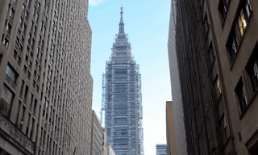
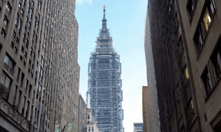
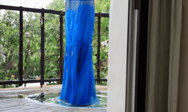

  

# Draft Attention

This repository provides an overview of all resources for the paper 
["DraftAttention: Fast Video Diffusion via Low-Resolution Attention Guidance"]().

Draft Attention is a plug-and-play acceleration method for video diffusion transformers.

Draft Attention reshapes long queries and keys into frame-wise feature maps and applying 2D average pooling to downsample them.

Draft Attention provides the reference for the sparse attention in full length.

Draft Attention introduces minimal overhead by compressing the number of tokens 128x or larger.

## 🎥 Demo

<table>
  <tr>
    <td align="center">
       
      <em>Dense Attention</em>
    </td>
    <td align="center">
       
      <em>Sparse Video Generation (SVG)</em>
    </td>
    <td align="center">
       
      <em>Draft Attention (Ours)</em>
    </td>
  </tr>
</table>

  <strong>Prompt:</strong>
  <em>"The banks of the Thames, as the camera moves vertically from low to high."</em> 

<table>
  <tr>
    <td align="center">
       
      <em>Dense Attention</em>
    </td>
    <td align="center">
       
      <em>Sparse Video Generation (SVG)</em>
    </td>
    <td align="center">
       
      <em>Draft Attention (Ours)</em>
    </td>
  </tr>
</table>

  <strong>Prompt:</strong>
  <em>"On the green grass, the white-walled Leaning Tower of Pisa stands tall. The camera moves vertically from top to bottom during filming."</em> 

<table>
  <tr>
    <td align="center">
       
      <em>Dense Attention</em>
    </td>
    <td align="center">
       
      <em>Sparse Video Generation (SVG)</em>
    </td>
    <td align="center">
       
      <em>Draft Attention (Ours)</em>
    </td>
  </tr>
</table>

  <strong>Prompt:</strong>
  <em>"A blue long dress fell from the balcony clothes rack and dropped into the water on the ground."</em> 

Prompts are all from the <a href="https://github.com/Tencent/HunyuanVideo/blob/main/assets/PenguinVideoBenchmark.csv">Penguin Video Benchmark</a>. 

Videos are generated with sparsity 90%, seed 42, using Hunyuan model in 768p on A100 GPU.

## 🚀 Quick Start

### Model Preparation
Please follow the instruction of environment setup and download the checkpoint from [HunyuanVideo](https://github.com/Tencent/HunyuanVideo) and [Wan](https://github.com/Wan-Video/Wan2.1).

### Sparse Attention
We mainly adopt the [block sparse attention](https://github.com/mit-han-lab/Block-Sparse-Attention) for draft attention.

### Video Generation
Simply run video generation with scripts in `hunyuan/` or `wan/`.

Evaluation results in the paper are mainly achieved with [VBench](https://github.com/Vchitect/VBench) on [Penguin Video Benchmark](https://github.com/Tencent/HunyuanVideo/blob/main/assets/PenguinVideoBenchmark.csv).

## 📑 Acknowledgement
This work is mainly contributed by [Xuan](https://shawnricecake.github.io) and [Chenxia](https://cxhan.com/).

