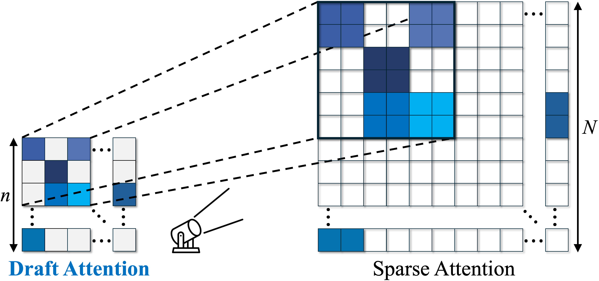
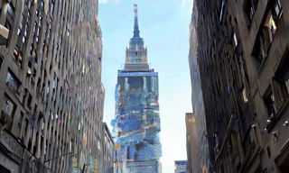
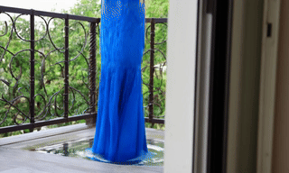

<p align="center">
  
</p>

# Draft Attention

This repository provides an overview of all resources for the paper 
["DraftAttention: Fast Video Diffusion via Low-Resolution Attention Guidance"]().


Draft Attention is a plug-and-play acceleration method for video diffusion transformers.

Draft Attention reshapes long queries and keys into frame-wise feature maps and applying 2D average pooling to downsample them.

Draft Attention provides the reference for the sparse attention in full length.

Draft Attention introduces minimal overhead by compressing the number of tokens 128x or larger.


## 🔥 News
- [2025/05] We support [HunyuanCustom](https://github.com/Tencent/HunyuanCustom) with classifier free guidance.


## 🎥 Demo

### Hunyuan
<table>
  <tr>
    <td align="center">
      <br>
      <em>Dense Attention</em>
    </td>
    <td align="center">
      <br>
      <em><a href="https://github.com/svg-project/Sparse-VideoGen/tree/main?tab=readme-ov-file" target="_blank">Sparse Video Generation (SVG)</a></em>
    </td>
    <td align="center">
      <br>
      <em>Draft Attention (Ours)</em>
    </td>
  </tr>
</table>
<p align="center">
  <strong>Prompt:</strong>
  <em>"The banks of the Thames, as the camera moves vertically from low to high."</em><br>
</p>

<div style="margin-top: 35px;"></div>

<table>
  <tr>
    <td align="center">
      <br>
      <em>Dense Attention</em>
    </td>
    <td align="center">
      <br>
      <em><a href="https://github.com/svg-project/Sparse-VideoGen/tree/main?tab=readme-ov-file" target="_blank">Sparse Video Generation (SVG)</a></em>
    </td>
    <td align="center">
      <br>
      <em>Draft Attention (Ours)</em>
    </td>
  </tr>
</table>
<p align="center">
  <strong>Prompt:</strong>
  <em>"On the green grass, the white-walled Leaning Tower of Pisa stands tall. The camera moves vertically from top to bottom during filming."</em><br>
</p>

<div style="margin-top: 35px;"></div>

<table>
  <tr>
    <td align="center">
      <br>
      <em>Dense Attention</em>
    </td>
    <td align="center">
      <br>
      <em><a href="https://github.com/svg-project/Sparse-VideoGen/tree/main?tab=readme-ov-file" target="_blank">Sparse Video Generation (SVG)</a></em>
    </td>
    <td align="center">
      <br>
      <em>Draft Attention (Ours)</em>
    </td>
  </tr>
</table>
<p align="center">
  <strong>Prompt:</strong>
  <em>"A blue long dress fell from the balcony clothes rack and dropped into the water on the ground."</em><br>
</p>

Prompts are all from the <a href="https://github.com/Tencent/HunyuanVideo/blob/main/assets/PenguinVideoBenchmark.csv">Penguin Video Benchmark</a>. 

Videos are generated with sparsity 90%, seed 42, using Hunyuan model in 768p on A100 GPU.

### HunyuanCustom

<table>
  <tr>
    <td align="center">
      <br>
      <em>Input Image</em>
    </td>
    <td align="center">
      <br>
      <em>Dense Attention</em>
    </td>
    <td align="center">
      <br>
      <em>Draft Attention (Ours)</em>
    </td>
  </tr>
</table>
<p align="center">
  <strong>Prompt:</strong>
  <em>"Realistic, High-quality. A woman is drinking coffee at a café."</em><br>
</p>

Videos are generated with seed 42 in 768p resolution on 8xA100 GPUs, with either dense attention or 90% sparse attention.


## 🚀 Quick Start

### Model Preparation
Please follow the instruction of environment setup and download the checkpoint from [HunyuanVideo](https://github.com/Tencent/HunyuanVideo), [Wan2.1](https://github.com/Wan-Video/Wan2.1), and [HunyuanCustom](https://github.com/Tencent/HunyuanCustom).

### Sparse Attention
We mainly adopt the [block sparse attention](https://github.com/mit-han-lab/Block-Sparse-Attention) for draft attention.

### Video Generation
Simply run video generation with scripts in `hunyuan/`, `wan/` or `hunyuan_custom/`.

Evaluation results in the paper are mainly achieved with [VBench](https://github.com/Vchitect/VBench) on [Penguin Video Benchmark](https://github.com/Tencent/HunyuanVideo/blob/main/assets/PenguinVideoBenchmark.csv) using HunyuanVideo and Wan2.1.

### Use for Your Own
You can simply use the draft attention similar as the flash attention through the `Draft_Attention` defined in `draft_attention.py` or `draft_attention_classifier_free_guidance.py`.

Here is the example for hunyuan model:
```python3
from draft_attention import Draft_Attention

draft_attention = Draft_Attention(
    pool_h=8,
    pool_w=16,
    latent_h=48,
    latent_w=80,
    visual_len=126_720,
    text_len=256,
    sparsity_ratio=0.9,
)

x = draft_attention(
    q,
    k,
    v,
    attn_mask=attn_mask,
    causal=causal,
    drop_rate=drop_rate,
    cu_seqlens_q=cu_seqlens_q,
    cu_seqlens_kv=cu_seqlens_kv,
    max_seqlen_q=max_seqlen_q,
    max_seqlen_kv=max_seqlen_kv,
    batch_size=batch_size,
)
```

## ✏️ TODO
- [ ] Support any-resolution video generation with padding.
- [ ] Support reordering of further block sparse grouping for faster hardware execution.

## 📑 Acknowledgement
This work is mainly contributed by [Xuan](https://shawnricecake.github.io) and [Chenxia](https://cxhan.com/).


